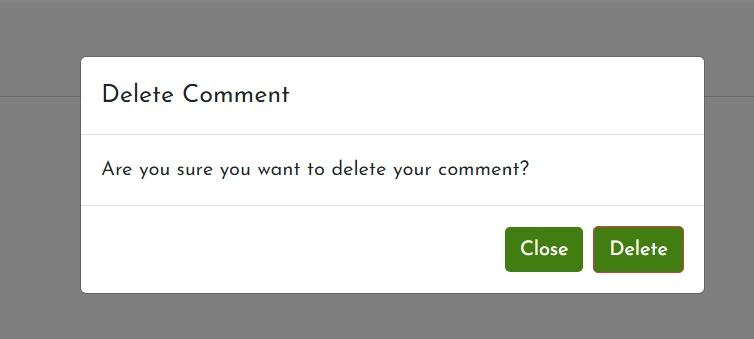

# Smoothie Website - Introduction

This is my Project 4 for Code Institute Full-stack development program.
This project is a Full Stack website built using the Django framework. Smoothies Blog website is a smoothies recipe template where users can look for a healthy smoothie to prepare. The looged in Users can also 
like/unlike a post and leave comments on a post. They can also participate on our challenges and share their experience with other users.

[Find my Live Project Here !](https://smoothies-blog-fb8590efb21e.herokuapp.com/)

# Content Table
- [Smoothie Website - Introduction](#smoothie-website---introduction)
- [Content Table](#content-table)
  - [User Experience - UX](#user-experience---ux)
    - [User Stories](#user-stories)
    - [Agile Methodology](#agile-methodology)
    - [The Scope](#the-scope)
      - [Main Site Goals](#main-site-goals)
  - [Design](#design)
      - [Colours](#colours)
      - [Typography](#typography)
      - [Imagery](#imagery)
    - [Wireframes](#wireframes)
  - [Database Diagram](#database-diagram)
  - [Features](#features)
    - [Home Page](#home-page)
    - [About Page](#about-page)
    - [Blog Page](#blog-page)
    - [Recipe Detail Page](#recipe-detail-page)
    - [Edit Comments Page](#edit-comments-page)
    - [Contact Page](#contact-page)
    - [Categories Page](#categories-page)
    - [Categories Results](#categories-results)
    - [challenge Page](#challenge-page)
    - [Add Challenge Page](#add-challenge-page)
    - [Search Page](#search-page)
    - [Search Results Page](#search-results-page)
    - [Signup Page](#signup-page)
    - [Login Page](#login-page)
    - [Logout Page](#logout-page)
    - [User Profile Page](#user-profile-page)
    - [Navbar](#navbar)
  - [Messages and Interaction With Users](#messages-and-interaction-with-users)
    - [Sign up](#sign-up)
    - [Login](#login)
    - [Logout](#logout)
    - [Profile Update](#profile-update)
    - [Like Post](#like-post)
    - [Unlike Post](#unlike-post)
    - [Comment Post](#comment-post)
    - [Delete/Edit Comment](#deleteedit-comment)
    - [Edit Comment](#edit-comment)
    - [Email Sent - Success](#email-sent---success)
    - [Email Sent - Failed](#email-sent---failed)
  - [Admin Panel/Superuser](#admin-panelsuperuser)
    - [Future Features](#future-features)
  - [Technologies Used](#technologies-used)
    - [Languages Used](#languages-used)
      - [Django Packages](#django-packages)
    - [Frameworks - Libraries - Programs Used](#frameworks---libraries---programs-used)
    - [Testing](#testing)
  - [Creating the Django app](#creating-the-django-app)
  - [Deployment of This Project](#deployment-of-this-project)
  - [Final Deployment](#final-deployment)
  - [Forking This Project](#forking-this-project)
  - [Cloning This Project](#cloning-this-project)
  - [Credits](#credits)
    - [Content](#content)
  - [Special Thanks](#special-thanks)

## User Experience - UX

### User Stories

* As a website user, I can:

1. Easily navigate around the site.
2. View a list of recipes and select a recipe to read.
3. Search for a specific recipe.
4. Open a post to read the details.
5. create an account to get the members features.
6. View the number of likes on a post.
7. View comments on a post.

* As logged in website user, I can:

1. Like and unlike recipes.
2. Comment on recipes.
3. Delete or edit my previous comments.
4. update my profile informations.
5. Share my experience with smoothies.
6. Edit or delete my previously experience.
7. Logout from the website.

* As a website superuser, I can:

1. Create and publish a new recipe.
2. Create draft recipe posts that can be reviewed and finalised later.
3. Create/Delete a new user, recipes, author and categories.
4. Approve user's comments.
5. Delete user's challenge that was posted previously.
6. Change the website permissions for a user.

### Agile Methodology

All functionality and development of this project were managed using GitHub which Projects can be found
[here](https://github.com/soukasamadi/Smoothies-blog/issues)

### The Scope

#### Main Site Goals

* To provide users with a good experience when using the website.
* To provide users with a visually pleasing website that is intuitive to use and easy to navigate.
* To provide a website with a clear purpose.
* To provide role-based permissions that allows user to interact with the website.

## Design

#### Colours

 

* I choosed this colores to make the website simple and close to smoothies colores.
  
#### Typography

* "Josefin Sans" font is used as the main font for the whole website.

#### Imagery

* All the imagery is related to the recipes and website design.
The remaining imagery will be uploaded by the author to the database.

### Wireframes

I craeted a couple of wireframe to get a close idea about how the wesbite will look like.

## Database Diagram

 
The favorite field is related to a future feature (Add recipes to favorite list).

## Features

### Home Page

* The hero image welcomes the user with a short message advertising what the website is about. These
are 3 carousel images with a button. When the button is pressed, it brings the user down to the highlighted recipes. 

* In the latest recipes, users can see a selection of 6 recipes. These recipes are
chosen by the site admin by clicking the featured box in the post database. 

### About Page

* The About Page gives, users information about the website. It tells the users the main pupose ofteh website  

### Blog Page

* On the Blog Page, users have access to the full recipes posts available on the website and they can also get more informations about smoothies and healthy meals routine.

### Recipe Detail Page 

* At this page users can discover the smoothie ingredients and get more information about the recipe.
* At the bottom of this page, users can read the comments posted by other users. If the user is logged in or is a 
superuser they have access to the buttons for deleting or updating comments.

### Edit Comments Page

* On this page, users are allowed to edit their own post comments.

### Contact Page

  

* The Contact Page allows users to get access to smoothies website contact details and they can also send email using the contac form there.

### Categories Page

  

* On the Categories Page, users can see the categories available in the blog and filter the posts by category.

### Categories Results

* On the Categories posts Page, users can access the post filtered by the chosen category.
  
### challenge Page

* On this page, registered users candiscover other users experince. If they had already published 
  a post they are allowed to edit or delete their own posts

### Add Challenge Page

* On this page, registered users can fill out the form to add or edit a post with their favourite cookbooks.

### Search Page

* In this page,  users can search by inputting a keyword in the search tool.

### Search Results Page

* On the Search Results Page, users can see the recipes found by their search.  When their recipe is located, the user can go to the 
  Post Details Page by clicking on the card result.

### Signup Page

* On the Signup Page, a new user can sign up for the website by filling out and then submitting the form.

### Login Page

* On the Login Page, users can log in to the website by inputting the username and password.

### Logout Page

* On the Logout Page, users can confirm the logout.

### User Profile Page

* On the Profile Page, users can update their informations.

### Navbar

## Messages and Interaction With Users

* Some interactive messages were added to the project to make the navigation on the website easier and to improve the
user's experience.

### Sign up

### Login

### Logout

### Profile Update

### Like Post

### Unlike Post

### Comment Post

### Delete/Edit Comment

### Edit Comment

### Email Sent - Success

### Email Sent - Failed

You can find all the interactive message [here](https://github.com/soukasamadi/Smoothies-blog/tree/main/assets/readme/interactive-message).

## Admin Panel/Superuser

* On the Admin Panel, as an admin/superuser I have full access to CRUD functionality so I can view, create, edit and
delete the following ones:

1. Recipes
2. Comments
3. Author
4. Categories
5. Profiles
6. challenges
   
* As superuser I can also approve comments, challenge#s posts and change the status and give other permissions to the users. 

### Future Features

* I would like to add favorite feature so logged-in User can add recipes to their favorite list so that they can come back easily to check favorited recipes anytime.
* I would like to add meals programms for registred users.
* ...
  
  ## Technologies Used

### Languages Used

* [HTML 5](https://en.wikipedia.org/wiki/HTML/)
* [CSS 3](https://en.wikipedia.org/wiki/CSS)
* [JavaScript](https://www.javascript.com/)
* [Django](https://www.python.org/)
* [Python](https://www.djangoproject.com/)

#### Django Packages

* [Gunicorn](https://gunicorn.org/) 
   As the server for Heroku
* [Cloudinary](https://cloudinary.com/) 
   Was used to host the static files and media
* [Dj_database_url](https://pypi.org/project/dj-database-url/) 
   To parse the database URL from the environment variables in Heroku
* [Psycopg2](https://pypi.org/project/psycopg2/) 
   As an adaptor for Python and PostgreSQL databases
* [Summernote](https://summernote.org/) 
   As a text editor
* [Allauth](https://django-allauth.readthedocs.io/en/latest/installation.html) 
   For authentication, registration, account
   management
* [Crispy Forms](https://django-crispy-forms.readthedocs.io/en/latest/) 
   To style the forms

### Frameworks - Libraries - Programs Used

* [Bootstrap](https://getbootstrap.com/) 
   Was used to style the website, add responsiveness and interactivity
* [Jquery](https://jquery.com/) 
   All the scripts were written using jquery library
* [Git](https://git-scm.com/) 
   Git was used for version control by utilizing the Gitpod terminal to commit to Git and push to GitHub
* [GitHub](https://github.com/) 
   GitHub is used to store the project's code after being pushed from Git
* [Heroku](https://id.heroku.com) 
   Heroku was used to deploy the live project
* [PostgreSQL](https://www.postgresql.org/) 
   Database used through heroku.
* [VSCode](https://code.visualstudio.com/) 
   VSCode was used to create and edit the website
* [Lucidchart](https://lucid.app/) 
   Lucidchart was used to create the database diagram
* [PEP8](http://pep8online.com/) 
   PEP8 was used to validate all the Python code
* [W3C - HTML](https://validator.w3.org/) 
   W3C- HTML was used to validate all the HTML code
* [W3C - CSS](https://jigsaw.w3.org/css-validator/) 
   W3C - CSS was used to validate the CSS code
* [Fontawesome](https://fontawesome.com/) 
   To add icons to the website
* [Google Chrome Dev Tools](https://developer.chrome.com/docs/devtools/) 
   To check App responsiveness and debugging
* [Google Fonts](https://fonts.google.com/) 
   To add the 2 fonts that were used throughout the project
* [CANVA](https://www.canva.com/) 
   To build the logos for the project and to build wireframes
* [Coolors](https://coolors.co/) 
   To build the colour palette of the project
* [Emailjs](https://www.emailjs.com/) 
   To send emails from the contact form

### Testing

Testing results [here](TESTING.md)

## Creating the Django app

1. Go to the Code Institute Gitpod Full Template [Template](https://github.com/Code-Institute-Org/gitpod-full-template)
2. Click on Use This Template
3. Once the template is available in your repository click on Gitpod
4. When the image for the template and the Gitpod are ready open a new terminal to start a new Django App
5. Install Django and gunicorn: `pip3 install django gunicorn`
6. Install supporting database libraries dj_database_url and psycopg2 library: `pip3 install dj_database_url psycopg2`
7. Create file for requirements: in the terminal window type `pip freeze --local > requirements.txt`
8. Create project: in the terminal window type django-admin startproject your_project_name
9. Create app: in the terminal window type python3 manage.py startapp your_app_name
10. Add app to the list of installed apps in settings.py file: you_app_name
11. Migrate changes: in the terminal window type python3 manage.py migrate
12. Run the server to test if the app is installed, in the terminal window type python3 manage.py runserver
13. If the app has been installed correctly the window will display The install worked successfully! Congratulations!

 
## Deployment of This Project

* This site was deployed by completing the following steps:

1. Log in to [Heroku](https://id.heroku.com) or create an account
2. On the main page click the button labelled New in the top right corner and from the drop-down menu select Create New
App
3. You must enter a unique app name
4. Next select your region
5. Click on the Create App button
6. Click in resources and select Heroku Postgres database
7. Click Reveal Config Vars and add a new record with SECRET_KEY
8. Click Reveal Config Vars and add a new record with the `CLOUDINARY_URL`
9. Click Reveal Config Vars and add a new record with the `DISABLE_COLLECTSTATIC = 1`
10. The next page is the project’s Deploy Tab. Click on the Settings Tab and scroll down to Config Vars
11. Next, scroll down to the Buildpack section click Add Buildpack select python and click Save Changes
12. Scroll to the top of the page and choose the Deploy tab
13. Select Github as the deployment method
14. Confirm you want to connect to GitHub
15. Search for the repository name and click the connect button
16. Scroll to the bottom of the deploy page and select the preferred deployment type
17. Click either Enable Automatic Deploys for automatic deployment when you push updates to Github

## Final Deployment 

1. Create a runtime.txt `python-3.8.13`
2. Create a Procfile `web: gunicorn your_project_name.wsgi`
3. When development is complete change the debug setting to: `DEBUG = False` in settings.py
4. In this project the summernote editor was used so for this to work in Heroku add: `X_FRAME_OPTIONS = SAMEORIGIN `to
   settings.py.
5. In Heroku settings, delete the config vars for `DISABLE_COLLECTSTATIC = 1

## Forking This Project

* Fork this project by following the steps:

1. Open [GitHub](https://github.com/soukasamadi/Smoothies-blog)
2. Find the 'Fork' button at the top right of the page
3. Once you click the button the fork will be in your repository

## Cloning This Project

* Clone this project by following the steps:

1. Open [GitHub](https://github.com/soukasamadi/Smoothies-blog)
2. You will be provided with three options to choose from, HTTPS, SSH or GitHub CLI, click the clipboard icon in order
to copy the URL
1. Once you click the button the fork will be in your repository
2. Open a new terminal
3. Change the current working directory to the location that you want the cloned directory
4. Type 'git clone' and paste the URL copied in step 3
5. Press 'Enter' and the project is cloned

## Credits

### Content

* All food recipes were taken from (and I was inspired by )[Simple green smoothies](https://simplegreensmoothies.com/)
* The images were sourced from [Simple green smoothies too](https://simplegreensmoothies.com/)
* The logo and favicon are my own design and build using canvas

## Special Thanks

I am grateful for the creators of the tutorial for their efforts in creating a helpful learning material.
I would like to express my gratitude and extend my thanks to the following individuals who have been instrumental in my journey:

* Akshat_Garg, my mentor, for his invaluable feedback, advice, guidance, and support throughout this experience.
* Kai_Ci, our cohort facilitator, for her dedication and weekly meetings where she has provided guidance, support, and encouragement to our cohort.
* The wonderful members of the Code Institute Slack community for their willingness to provide peer code reviews and support.

I am truly grateful for their contributions, which have greatly enriched my learning and development.

  

